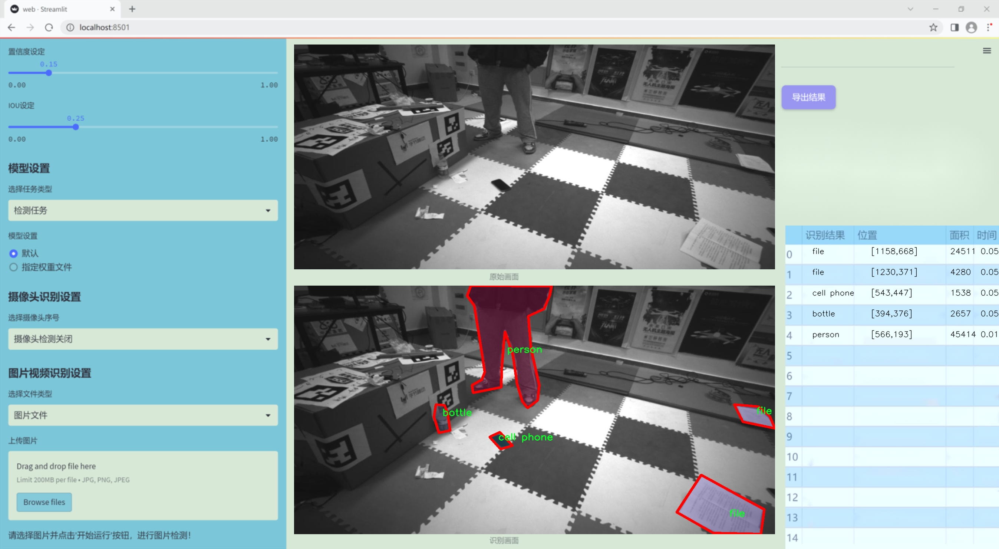

### 1.背景意义

研究背景与意义

随着人工智能技术的迅猛发展，物品识别与分类在各个领域的应用日益广泛，包括智能监控、自动驾驶、智能家居等。物品识别技术的核心在于计算机视觉，它使得机器能够理解和处理图像数据，从而实现对物体的自动识别和分类。近年来，基于深度学习的目标检测算法如YOLO（You Only Look Once）系列，因其高效性和准确性而备受关注。YOLOv11作为该系列的最新版本，结合了多种先进的技术，能够在实时性和精度之间取得良好的平衡。

本研究旨在基于改进的YOLOv11模型，构建一个高效的物品识别与分类系统。我们使用的数据集包含1300张图像，涵盖14个类别，包括背包、瓶子、手机、椅子等日常物品。这些类别的选择不仅具有代表性，而且在实际应用中具有较高的需求。通过对这些物品的准确识别和分类，能够为智能家居、零售管理等领域提供重要的数据支持，进而提升用户体验和操作效率。

在数据集的构建过程中，我们采用了多种预处理技术，以确保图像数据的质量和一致性。这些措施为后续的模型训练提供了良好的基础。此外，随着数据集的不断扩展和改进，系统的识别能力也将不断提升，从而适应更复杂的应用场景。

综上所述，本研究不仅具有重要的理论意义，也为实际应用提供了可行的解决方案。通过对YOLOv11的改进和优化，我们期望能够在物品识别与分类领域取得更为显著的成果，为推动智能视觉技术的发展贡献一份力量。

### 2.视频效果

[2.1 视频效果](https://www.bilibili.com/video/BV11ukRYCErV/)

### 3.图片效果




##### [项目涉及的源码数据来源链接](https://kdocs.cn/l/cszuIiCKVNis)**

注意：本项目提供训练的数据集和训练教程,由于版本持续更新,暂不提供权重文件（best.pt）,请按照6.训练教程进行训练后实现上图演示的效果。

### 4.数据集信息

##### 4.1 本项目数据集类别数＆类别名

nc: 14
names: ['backpack', 'bottle', 'cell phone', 'chair', 'file', 'keyboard', 'knife', 'laptop', 'mazha', 'monitor', 'mouse', 'person', 'remote control', 'table']


该项目为【图像分割】数据集，请在【训练教程和Web端加载模型教程（第三步）】这一步的时候按照【图像分割】部分的教程来训练

##### 4.2 本项目数据集信息介绍

本项目数据集信息介绍

本项目所使用的数据集名为“traindataset-1500”，其设计旨在支持改进YOLOv11的物品识别与分类系统。该数据集包含14个不同的类别，涵盖了日常生活中常见的物品，具体类别包括背包（backpack）、瓶子（bottle）、手机（cell phone）、椅子（chair）、文件夹（file）、键盘（keyboard）、刀具（knife）、笔记本电脑（laptop）、麻扎（mazha）、显示器（monitor）、鼠标（mouse）、人（person）、遥控器（remote control）以及桌子（table）。这些类别的选择不仅考虑了物品的多样性，还确保了数据集在实际应用中的广泛适用性。

数据集的构建过程中，收集了大量高质量的图像，确保每个类别都有足够的样本量，以便于模型的有效训练。每个类别的图像均经过精心标注，确保在训练过程中能够准确地识别和分类。这种细致的标注工作为YOLOv11模型的学习提供了丰富的上下文信息，使其能够在不同场景下更好地理解和识别物体。

此外，数据集的多样性体现在图像的拍摄角度、光照条件以及背景环境等方面，这些因素的变化使得模型在训练过程中能够获得更强的泛化能力，从而在实际应用中表现出色。通过使用“traindataset-1500”，我们期望改进YOLOv11在物品识别与分类任务中的准确性和效率，使其能够在更复杂的环境中进行有效的物体检测和分类。这一数据集的构建不仅为模型的训练提供了坚实的基础，也为未来的研究和应用提供了宝贵的资源。


### 5.全套项目环境部署视频教程（零基础手把手教学）

[5.1 所需软件PyCharm和Anaconda安装教程（第一步）](https://www.bilibili.com/video/BV1BoC1YCEKi/?spm_id_from=333.999.0.0&vd_source=bc9aec86d164b67a7004b996143742dc)


[5.2 安装Python虚拟环境创建和依赖库安装视频教程（第二步）](https://www.bilibili.com/video/BV1ZoC1YCEBw?spm_id_from=333.788.videopod.sections&vd_source=bc9aec86d164b67a7004b996143742dc)

### 6.改进YOLOv11训练教程和Web_UI前端加载模型教程（零基础手把手教学）

[6.1 改进YOLOv11训练教程和Web_UI前端加载模型教程（第三步）](https://www.bilibili.com/video/BV1BoC1YCEhR?spm_id_from=333.788.videopod.sections&vd_source=bc9aec86d164b67a7004b996143742dc)


按照上面的训练视频教程链接加载项目提供的数据集，运行train.py即可开始训练



     Epoch   gpu_mem       box       obj       cls    labels  img_size
     1/200     20.8G   0.01576   0.01955  0.007536        22      1280: 100%|██████████| 849/849 [14:42<00:00,  1.04s/it]
               Class     Images     Labels          P          R     mAP@.5 mAP@.5:.95: 100%|██████████| 213/213 [01:14<00:00,  2.87it/s]
                 all       3395      17314      0.994      0.957      0.0957      0.0843

     Epoch   gpu_mem       box       obj       cls    labels  img_size
     2/200     20.8G   0.01578   0.01923  0.007006        22      1280: 100%|██████████| 849/849 [14:44<00:00,  1.04s/it]
               Class     Images     Labels          P          R     mAP@.5 mAP@.5:.95: 100%|██████████| 213/213 [01:12<00:00,  2.95it/s]
                 all       3395      17314      0.996      0.956      0.0957      0.0845

     Epoch   gpu_mem       box       obj       cls    labels  img_size
     3/200     20.8G   0.01561    0.0191  0.006895        27      1280: 100%|██████████| 849/849 [10:56<00:00,  1.29it/s]
               Class     Images     Labels          P          R     mAP@.5 mAP@.5:.95: 100%|███████   | 187/213 [00:52<00:00,  4.04it/s]
                 all       3395      17314      0.996      0.957      0.0957      0.0845


###### [项目数据集下载链接](https://kdocs.cn/l/cszuIiCKVNis)

### 7.原始YOLOv11算法讲解


YOLO11 是 Ultralytics YOLO 系列的最新版本，结合了尖端的准确性、速度和效率，用于目标检测、分割、分类、定向边界框和姿态估计。与
YOLOv8 相比，它具有更少的参数和更好的结果，不难预见，YOLO11 在边缘设备上更高效、更快，将频繁出现在计算机视觉领域的最先进技术（SOTA）中。


**主要特点**

  * **增强的特征提取：**YOLO11 使用改进的主干和颈部架构来增强特征提取，以实现更精确的目标检测和复杂任务的性能。

  * **针对效率和速度优化：**精细的架构设计和优化的训练流程在保持准确性和性能之间最佳平衡的同时，提供更快的处理速度。

  * **更少的参数，更高的准确度：**YOLO11m 在 COCO 数据集上实现了比 YOLOv8m 更高的 mAP，参数减少了 22%，提高了计算效率，同时不牺牲准确度。

  * **跨环境的适应性：**YOLO11 可以无缝部署在边缘设备、云平台和配备 NVIDIA GPU 的系统上，确保最大的灵活性。

  * **支持广泛的任务范围：**YOLO11 支持各种计算机视觉任务，如目标检测、实例分割、图像分类、姿态估计和定向目标检测（OBB）。


### 8.200+种全套改进YOLOV11创新点原理讲解

#### 8.1 200+种全套改进YOLOV11创新点原理讲解大全

由于篇幅限制，每个创新点的具体原理讲解就不全部展开，具体见下列网址中的改进模块对应项目的技术原理博客网址【Blog】（创新点均为模块化搭建，原理适配YOLOv5~YOLOv11等各种版本）

[改进模块技术原理博客【Blog】网址链接](https://gitee.com/qunmasj/good)


#### 8.2 精选部分改进YOLOV11创新点原理讲解

###### 这里节选部分改进创新点展开原理讲解(完整的改进原理见上图和[改进模块技术原理博客链接](https://gitee.com/qunmasj/good)【如果此小节的图加载失败可以通过CSDN或者Github搜索该博客的标题访问原始博客，原始博客图片显示正常】
### 深度学习基础
卷积神经网络通过使用具有共享参数的卷积运算显著降低了模型的计算开销和复杂性。在LeNet、AlexNet和VGG等经典网络的驱动下，卷积神经网络现在已经建立了一个完整的系统，并在深度学习领域形成了先进的卷积神经网络模型。

感受野注意力卷积RFCBAMConv的作者在仔细研究了卷积运算之后获得了灵感。对于分类、目标检测和语义分割任务，一方面，图像中不同位置的对象的形状、大小、颜色和分布是可变的。在卷积操作期间，卷积核在每个感受野中使用相同的参数来提取信息，而不考虑来自不同位置的差分信息。这限制了网络的性能，这已经在最近的许多工作中得到了证实。

另一方面，卷积运算没有考虑每个特征的重要性，这进一步影响了提取特征的有效性，并最终限制了模型的性能。此外，注意力机制允许模型专注于重要特征，这可以增强特征提取的优势和卷积神经网络捕获详细特征信息的能力。因此，注意力机制在深度学习中得到了广泛的应用，并成功地应用于各个领域。

通过研究卷积运算的内在缺陷和注意力机制的特点，作者认为现有的空间注意力机制从本质上解决了卷积运算的参数共享问题，但仍局限于对空间特征的认知。对于较大的卷积核，现有的空间注意力机制并没有完全解决共享参数的问题。此外，他们无法强调感受野中每个特征的重要性，例如现有的卷积块注意力模块（CBAM）和 Coordinate注意力（CA）。

因此，[参考该博客提出了一种新的感受野注意力机制（RFA）](https://qunmasj.com)，它完全解决了卷积核共享参数的问题，并充分考虑了感受野中每个特征的重要性。通过RFA设计的卷积运算（RFAConv）是一种新的卷积运算，可以取代现有神经网络中的标准卷积运算。RFAConv通过添加一些参数和计算开销来提高网络性能。

大量关于Imagnet-1k、MS COCO和VOC的实验已经证明了RFAConv的有效性。作为一种由注意力构建的新型卷积运算，它超过了由CAM、CBAM和CA构建的卷积运算（CAMConv、CBAMConv、CAConv）以及标准卷积运算。

此外，为了解决现有方法提取感受野特征速度慢的问题，提出了一种轻量级操作。在构建RFAConv的过程中，再次设计了CA和CBAM的升级版本，并进行了相关实验。作者认为当前的空间注意力机制应该将注意力放在感受野空间特征上，以促进当前空间注意力机制的发展，并再次增强卷积神经网络架构的优势。


### 卷积神经网络架构
出色的神经网络架构可以提高不同任务的性能。卷积运算作为卷积神经网络的一种基本运算，推动了人工智能的发展，并为车辆检测、无人机图像、医学等先进的网络模型做出了贡献。He等人认为随着网络深度的增加，该模型将变得难以训练并产生退化现象，因此他们提出了残差连接来创新卷积神经网络架构的设计。Huang等人通过重用特征来解决网络梯度消失问题，增强了特征信息，他们再次创新了卷积神经网络架构。

通过对卷积运算的详细研究，Dai等人认为，具有固定采样位置的卷积运算在一定程度上限制了网络的性能，因此提出了Deformable Conv，通过学习偏移来改变卷积核的采样位置。在Deformable Conv的基础上，再次提出了Deformable Conv V2和Deformable Conv V3，以提高卷积网络的性能。

Zhang等人注意到，组卷积可以减少模型的参数数量和计算开销。然而，少于组内信息的交互将影响最终的网络性能。1×1的卷积可以与信息相互作用。然而，这将带来更多的参数和计算开销，因此他们提出了无参数的“通道Shuffle”操作来与组之间的信息交互。

Ma等人通过实验得出结论，对于参数较少的模型，推理速度不一定更快，对于计算量较小的模型，推理也不一定更快。经过仔细研究提出了Shufflenet V2。

YOLO将输入图像划分为网格，以预测对象的位置和类别。经过不断的研究，已经提出了8个版本的基于YOLO的目标检测器，如YOLOv11、YOLOv11、YOLOv11等。上述卷积神经网络架构已经取得了巨大的成功。然而，它们并没有解决提取特征过程中的参数共享问题。本文的工作从注意力机制开始，从一个新的角度解决卷积参数共享问题。

### 注意力机制
注意力机制被用作一种提高网络模型性能的技术，使其能够专注于关键特性。注意力机制理论已经在深度学习中建立了一个完整而成熟的体系。Hu等人提出了一种Squeeze-and-Excitation（SE）块，通过压缩特征来聚合全局通道信息，从而获得与每个通道对应的权重。Wang等人认为，当SE与信息交互时，单个通道和权重之间的对应关系是间接的，因此设计了高效通道注Efficient Channel Attention力（ECA），并用自适应kernel大小的一维卷积取代了SE中的全连接（FC）层。Woo等人提出了卷积块注意力模块（CBAM），它结合了通道注意力和空间注意力。作为一个即插即用模块，它可以嵌入卷积神经网络中，以提高网络性能。

尽管SE和CBAM已经提高了网络的性能。Hou等人仍然发现压缩特征在SE和CBAM中丢失了太多信息。因此，他们提出了轻量级Coordinate注意力（CA）来解决SE和CBAM中的问题。Fu等人计了一个空间注意力模块和通道注意力模块，用于扩展全卷积网络（FCN），分别对空间维度和通道维度的语义相关性进行建模。Zhang等人在通道上生成不同尺度的特征图，以建立更有效的通道注意力机制。

本文从一个新的角度解决了标准卷积运算的参数共享问题。这就是将注意力机制结合起来构造卷积运算。尽管目前的注意力机制已经获得了良好的性能，但它们仍然没有关注感受野的空间特征。因此，设计了具有非共享参数的RFA卷积运算，以提高网络的性能。


#### 回顾标准卷积
以标准卷积运算为基础构建卷积神经网络，通过共享参数的滑动窗口提取特征信息，解决了全连接层构建的神经网络的固有问题（即参数数量大、计算开销高）。

设表示输入特征图，其中、和分别表示特征图的通道数、高度和宽度。为了能够清楚地展示卷积核提取特征信息的过程，以为例。提取每个感受野slider的特征信息的卷积运算可以表示如下：


这里，表示在每次卷积slider操作之后获得的值，表示在每个slider内的相应位置处的像素值。表示卷积核，表示卷积核中的参数数量，表示感受野slider的总数。

可以看出，每个slider内相同位置的特征共享相同的参数。因此，标准的卷积运算无法感知不同位置带来的差异信息，这在一定程度上限制了卷积神经网络的性能。

#### 回顾空间注意力
目前，空间注意力机制使用通过学习获得的注意力图来突出每个特征的重要性。与上一节类似，以为例。突出关键特征的空间注意力机制可以简单地表达如下：


这里，表示在加权运算之后获得的值。和分别表示输入特征图和学习注意力图在不同位置的值，是输入特征图的高度和宽度的乘积，表示像素值的总数。一般来说，整个过程可以简单地表示在图1中。


#### 空间注意力与标准卷积
众所周知，将注意力机制引入卷积神经网络可以提高网络的性能。通过标准的卷积运算和对现有空间注意力机制的仔细分析。作者认为空间注意力机制本质上解决了卷积神经网络的固有缺点，即共享参数的问题。

目前，该模型最常见的卷积核大小为1×1和3×3。引入空间注意力机制后用于提取特征的卷积操作是1×1或3×3卷积操作。这个过程可以直观地显示出来。空间注意力机制被插入到1×1卷积运算的前面。通过注意力图对输入特征图进行加权运算（Re-weight“×”），最后通过1×1卷积运算提取感受野的slider特征信息。

整个过程可以简单地表示如下：


 

这里，卷积核仅表示一个参数值。如果将的值作为一个新的卷积核参数，那么有趣的是，通过1×1卷积运算提取特征时的参数共享问题得到了解决。然而，空间注意力机制的传说到此结束。当空间注意力机制被插入到3×3卷积运算的前面时。具体情况如下：


如上所述，如果取的值。作为一种新的卷积核参数，上述方程完全解决了大规模卷积核的参数共享问题。然而，最重要的一点是，卷积核在每个感受野slider中提取将共享部分特征的特征。换句话说，在每个感受野slider内都会有重叠。

经过仔细分析发现，，…，空间注意力图的权重在每个slider内共享。因此，空间注意机制不能解决大规模卷积核共享参数的问题，因为它们不注意感受野的空间特征。在这种情况下，空间注意力机制是有限的。
#### 创新空间注意力与标准卷积
RFA是为了解决空间注意力机制问题而提出的，创新了空间注意力。使用与RFA相同的思想，一系列空间注意力机制可以再次提高性能。RFA设计的卷积运算可以被视为一种轻量级的即插即用模块，以取代标准卷积，从而提高卷积神经网络的性能。因此，作者认为空间注意力机制和标准卷积在未来将有一个新的春天。

感受野的空间特征：

现在给出感受野空间特征的定义。它是专门为卷积核设计的，并根据kernel大小动态生成，如图2所示，以3×3卷积核为例。


在图2中，“空间特征”表示原始特征图，等于空间特征。“感受野空间特征”表示变换后的特征，该特征由每个感受野slider滑块组成，并且不重叠。也就是说，“感受野空间特征”中的每个3×3大小的slider表示提取原始3×3卷积特征时所有感觉野slider的特征。

#### 感受野注意力卷积(RFA):

关于感受野空间特征，该博客的作者提出了感受野注意（RFA），它不仅强调了感受野slider内各种特征的重要性，而且还关注感受野空间特性，以彻底解决卷积核参数共享的问题。感受野空间特征是根据卷积核的大小动态生成的，因此，RFA是卷积的固定组合，不能脱离卷积运算的帮助，卷积运算同时依赖RFA来提高性能。

因此，作者提出了感受野注意力卷积（RFAConv）。具有3×3大小卷积核的RFAConv的总体结构如图3所示。


目前，提取感受野特征最常用的方法速度较慢，因此经过不断探索提出了一种快速的方法，通过分组卷积来取代原来的方法。

具体来说，根据感受野大小，使用相应的组卷积大小来动态生成展开特征。尽管与原始的无参数方法（如Pytorch提供的nn.Unfld()）相比，该方法添加了一些参数，但速度要快得多。

注意：正如在上一节中提到的，当原始的3×3卷积核提取特征时，感受野空间特征中的每个3×3大小的窗口表示所有感受野滑块的特征。但在快速分组卷积提取感受野特征后，由于原始方法太慢，它们会被映射到新的特征中。

最近的一些工作已经证明信息交互可以提高网络性能。类似地，对于RFAConv，与感受野特征信息交互以学习注意力图可以提高网络性能，但与每个感受野特征交互将带来额外的计算开销。为了确保少量的计算开销和参数数量，通过探索使用AvgPool池化每个感受野特征的全局信息，然后通过1×1组卷积运算与信息交互。最后，softmax用于强调感受野特征中每个特征的重要性。通常，RFA的计算可以表示为：


表示分组卷积，表示卷积核的大小，代表规范化，表示输入特征图，是通过将注意力图与变换的感受野空间特征相乘而获得的。

与CBAM和CA不同，RFA可以为每个感受野特征生成注意力图。标准卷积受到卷积神经网络性能的限制，因为共享参数的卷积运算对位置带来的差异信息不敏感。RFA完全可以解决这个问题，具体细节如下：


由于RFA获得的特征图是“调整形状”后不重叠的感受野空间特征，因此通过池化每个感受野滑块的特征信息来学习学习的注意力图。换句话说，RFA学习的注意力图不再在每个感受野slider内共享，并且是有效的。这完全解决了现有的CA和CBAM对大尺寸kernel的注意力机制中的参数共享问题。

同时，RFA给标准卷积核带来了相当大的好处，但调整形状后，特征的高度和宽度是k倍，需要进行k×k的stride卷积运算，才能提取特征信息。RFAConv创新了标准卷积运算。

此外，空间注意力机制将得到升级，因为作者认为现有的空间注意力机制应该专注于感受野空间特征，以提高网络的性能。众所周知，基于自注意力机制的网络模型取得了巨大的成功，因为它解决了卷积参数共享的问题，并对远程信息进行了建模，但基于自注意力机理的方法给模型带来了巨大的计算开销和复杂性。作者认为通过将一些现有空间注意力机制的注意力放在感受野空间特征中，它以轻量级的方式解决了自注意力机制的问题。

答案如下：

将关注感受野空间特征的空间注意力与卷积相匹配，完全解决了卷积参数共享的问题；

当前的空间注意力机制本身具有考虑远距离信息的特点，它们通过全局平均池化或全局最大池化来获得全局信息，这在一定程度上考虑了远距离信息。


为此，作者设计了一种新的CBAM和CA，称为RFACBAM和RFACA，它专注于感受野的空间特征。与RFA类似，使用stride为k的k×k的最终卷积运算来提取特征信息，具体结构如图4和图5所示，将这2种新的卷积方法称为RFCBAMConv和RFCAConv。比较原始的CBAM，使用SE注意力来代替RFCBAM中的CAM。因为这样可以减少计算开销。


此外，在RFCBAM中，通道和空间注意力不是在单独的步骤中执行的，因为通道和空间注意力是同时加权的，从而允许在每个通道上获得的注意力图是不同的。


### 9.系统功能展示

图9.1.系统支持检测结果表格显示

  图9.2.系统支持置信度和IOU阈值手动调节

  图9.3.系统支持自定义加载权重文件best.pt(需要你通过步骤5中训练获得)

  图9.4.系统支持摄像头实时识别

  图9.5.系统支持图片识别

  图9.6.系统支持视频识别

  图9.7.系统支持识别结果文件自动保存

  图9.8.系统支持Excel导出检测结果数据


### 10. YOLOv11核心改进源码讲解

#### 10.1 hcfnet.py

以下是对代码中最核心部分的分析和详细注释。我们将保留主要的类和方法，并对其功能进行解释。

```python
import math
import torch
import torch.nn as nn
import torch.nn.functional as F

# 定义空间注意力模块
class SpatialAttentionModule(nn.Module):
    def __init__(self):
        super(SpatialAttentionModule, self).__init__()
        # 2通道输入，1通道输出的卷积层
        self.conv2d = nn.Conv2d(in_channels=2, out_channels=1, kernel_size=7, stride=1, padding=3)
        self.sigmoid = nn.Sigmoid()  # Sigmoid激活函数

    def forward(self, x):
        # 计算输入x的平均值和最大值
        avgout = torch.mean(x, dim=1, keepdim=True)  # 平均值
        maxout, _ = torch.max(x, dim=1, keepdim=True)  # 最大值
        out = torch.cat([avgout, maxout], dim=1)  # 拼接平均值和最大值
        out = self.sigmoid(self.conv2d(out))  # 通过卷积和Sigmoid激活
        return out * x  # 乘以输入x，得到加权后的输出

# 定义局部-全局注意力模块
class LocalGlobalAttention(nn.Module):
    def __init__(self, output_dim, patch_size):
        super().__init__()
        self.output_dim = output_dim
        self.patch_size = patch_size
        # 定义两个全连接层和一个卷积层
        self.mlp1 = nn.Linear(patch_size * patch_size, output_dim // 2)
        self.norm = nn.LayerNorm(output_dim // 2)
        self.mlp2 = nn.Linear(output_dim // 2, output_dim)
        self.conv = nn.Conv2d(output_dim, output_dim, kernel_size=1)
        # 定义可学习的参数
        self.prompt = torch.nn.parameter.Parameter(torch.randn(output_dim, requires_grad=True)) 
        self.top_down_transform = torch.nn.parameter.Parameter(torch.eye(output_dim), requires_grad=True)

    def forward(self, x):
        x = x.permute(0, 2, 3, 1)  # 调整维度顺序
        B, H, W, C = x.shape  # 获取批量大小、高度、宽度和通道数
        P = self.patch_size

        # 局部分支
        local_patches = x.unfold(1, P, P).unfold(2, P, P)  # 获取局部patch
        local_patches = local_patches.reshape(B, -1, P * P, C)  # 重塑形状
        local_patches = local_patches.mean(dim=-1)  # 计算每个patch的平均值

        local_patches = self.mlp1(local_patches)  # 通过第一个全连接层
        local_patches = self.norm(local_patches)  # 归一化
        local_patches = self.mlp2(local_patches)  # 通过第二个全连接层

        local_attention = F.softmax(local_patches, dim=-1)  # 计算局部注意力
        local_out = local_patches * local_attention  # 加权输出

        # 计算余弦相似度
        cos_sim = F.normalize(local_out, dim=-1) @ F.normalize(self.prompt[None, ..., None], dim=1)  # 计算余弦相似度
        mask = cos_sim.clamp(0, 1)  # 限制在[0, 1]范围内
        local_out = local_out * mask  # 应用mask
        local_out = local_out @ self.top_down_transform  # 应用变换

        # 恢复形状
        local_out = local_out.reshape(B, H // P, W // P, self.output_dim)  # 重塑形状
        local_out = local_out.permute(0, 3, 1, 2)  # 调整维度顺序
        local_out = F.interpolate(local_out, size=(H, W), mode='bilinear', align_corners=False)  # 上采样
        output = self.conv(local_out)  # 通过卷积层

        return output

# 定义PPA模块
class PPA(nn.Module):
    def __init__(self, in_features, filters) -> None:
        super().__init__()
        # 定义多个卷积层和注意力模块
        self.skip = nn.Conv2d(in_features, filters, kernel_size=1)  # 跳跃连接
        self.c1 = nn.Conv2d(filters, filters, kernel_size=3, padding=1)
        self.c2 = nn.Conv2d(filters, filters, kernel_size=3, padding=1)
        self.c3 = nn.Conv2d(filters, filters, kernel_size=3, padding=1)
        self.sa = SpatialAttentionModule()  # 空间注意力模块
        self.lga2 = LocalGlobalAttention(filters, 2)  # 局部-全局注意力模块
        self.lga4 = LocalGlobalAttention(filters, 4)  # 局部-全局注意力模块
        self.drop = nn.Dropout2d(0.1)  # Dropout层
        self.bn1 = nn.BatchNorm2d(filters)  # 批归一化
        self.silu = nn.SiLU()  # SiLU激活函数

    def forward(self, x):
        x_skip = self.skip(x)  # 跳跃连接
        x_lga2 = self.lga2(x_skip)  # 局部-全局注意力
        x_lga4 = self.lga4(x_skip)  # 局部-全局注意力
        x1 = self.c1(x)  # 第一个卷积
        x2 = self.c2(x1)  # 第二个卷积
        x3 = self.c3(x2)  # 第三个卷积
        # 合并所有输出
        x = x1 + x2 + x3 + x_skip + x_lga2 + x_lga4
        x = self.bn1(x)  # 批归一化
        x = self.sa(x)  # 空间注意力
        x = self.drop(x)  # Dropout
        x = self.silu(x)  # SiLU激活
        return x

# 定义DASI模块
class DASI(nn.Module):
    def __init__(self, in_features, out_features) -> None:
        super().__init__()
        self.tail_conv = nn.Conv2d(out_features, out_features, kernel_size=1)  # 尾部卷积
        self.conv = nn.Conv2d(out_features // 2, out_features // 4, kernel_size=1)  # 卷积层
        self.bns = nn.BatchNorm2d(out_features)  # 批归一化
        # 定义跳跃连接
        self.skips = nn.Conv2d(in_features[1], out_features, kernel_size=1)
        self.skips_2 = nn.Conv2d(in_features[0], out_features, kernel_size=1)
        self.skips_3 = nn.Conv2d(in_features[2], out_features, kernel_size=3, stride=2, dilation=2, padding=2)
        self.silu = nn.SiLU()  # SiLU激活函数

    def forward(self, x_list):
        x_low, x, x_high = x_list  # 解包输入
        x_high = self.skips_3(x_high) if x_high is not None else None  # 跳跃连接
        x_low = self.skips_2(x_low) if x_low is not None else None  # 跳跃连接
        x = self.skips(x)  # 跳跃连接
        x_skip = x  # 保存跳跃连接的输出
        x = torch.chunk(x, 4, dim=1)  # 分块

        # 处理不同的输入组合
        if x_high is None:
            x0 = self.conv(torch.cat((x[0], x_low[0]), dim=1)) if x_low is not None else x[0]
            x1 = self.conv(torch.cat((x[1], x_low[1]), dim=1)) if x_low is not None else x[1]
            x2 = self.conv(torch.cat((x[2], x_low[2]), dim=1)) if x_low is not None else x[2]
            x3 = self.conv(torch.cat((x[3], x_low[3]), dim=1)) if x_low is not None else x[3]
        else:
            x0 = self.conv(torch.cat((x[0], x_high[0]), dim=1))
            x1 = self.conv(torch.cat((x[1], x_high[1]), dim=1))
            x2 = self.conv(torch.cat((x[2], x_high[2]), dim=1))
            x3 = self.conv(torch.cat((x[3], x_high[3]), dim=1))

        x = torch.cat((x0, x1, x2, x3), dim=1)  # 合并输出
        x = self.tail_conv(x)  # 尾部卷积
        x += x_skip  # 加上跳跃连接
        x = self.bns(x)  # 批归一化
        x = self.silu(x)  # SiLU激活
        return x
```

### 代码分析总结
1. **SpatialAttentionModule**: 计算输入特征图的空间注意力，通过对平均值和最大值的卷积操作来生成注意力权重。
2. **LocalGlobalAttention**: 结合局部和全局特征，通过MLP和注意力机制来处理输入特征图。
3. **PPA**: 主要的特征提取模块，结合卷积、空间注意力和局部-全局注意力来增强特征表示。
4. **DASI**: 处理多尺度特征，通过跳跃连接和卷积操作来融合不同层次的特征。

以上是对代码的核心部分及其功能的详细注释和分析。

这个文件定义了一个深度学习模型的几个模块，主要用于图像处理和特征提取。文件中包含多个类，每个类实现了特定的功能，以下是对各个部分的详细说明。

首先，`SpatialAttentionModule`类实现了空间注意力机制。它通过对输入特征图进行平均池化和最大池化，生成两个特征图，然后将这两个特征图拼接在一起，经过一个卷积层和Sigmoid激活函数，最终得到一个注意力权重图。这个权重图与输入特征图相乘，从而强调重要的空间区域。

接下来是`LocalGlobalAttention`类，它结合了局部和全局特征。该模块首先将输入特征图划分为多个局部块，然后通过多层感知机（MLP）对这些局部块进行处理，生成局部特征。通过计算局部特征与一个可学习的提示向量之间的余弦相似度，生成一个掩码，进一步调整局部特征。最后，这些特征被恢复到原始的空间维度，并通过卷积层输出。

`ECA`类实现了有效的通道注意力机制。它通过自适应平均池化生成特征图的全局信息，并使用一维卷积来生成通道权重。这个权重与输入特征图相乘，以增强重要通道的特征。

`PPA`类是一个更复杂的模块，结合了前面提到的多个机制。它首先通过卷积层提取特征，然后使用局部全局注意力模块和空间注意力模块来增强特征表示。最终，经过批归一化和激活函数处理后输出结果。

`Bag`类是一个简单的加权融合模块，它根据输入的边缘注意力图对两个输入特征进行加权组合。

最后，`DASI`类整合了多个输入特征，通过跳跃连接和卷积层进行特征融合。它使用`Bag`模块来结合不同层次的特征，并通过卷积和激活函数进行进一步处理。这个模块的设计允许在多尺度特征之间进行有效的信息传递。

总体来说，这个文件实现了一种复杂的深度学习结构，结合了注意力机制和多尺度特征融合，旨在提高图像处理任务的性能。每个模块的设计都旨在增强特征表示的能力，使得模型能够更好地捕捉图像中的重要信息。

#### 10.2 fast_kan_conv.py

以下是代码中最核心的部分，并附上详细的中文注释：

```python
import torch
import torch.nn as nn

class RadialBasisFunction(nn.Module):
    def __init__(self, grid_min: float = -2., grid_max: float = 2., num_grids: int = 8, denominator: float = None):
        super().__init__()
        # 创建一个线性空间，范围从grid_min到grid_max，包含num_grids个点
        grid = torch.linspace(grid_min, grid_max, num_grids)
        # 将grid参数化，不需要梯度更新
        self.grid = torch.nn.Parameter(grid, requires_grad=False)
        # 设置分母，默认为线性空间的范围除以网格数减一
        self.denominator = denominator or (grid_max - grid_min) / (num_grids - 1)

    def forward(self, x):
        # 计算径向基函数的输出
        # 这里使用了高斯函数的形式，计算每个输入x与grid中每个点的距离
        return torch.exp(-((x[..., None] - self.grid) / self.denominator) ** 2)

class FastKANConvNDLayer(nn.Module):
    def __init__(self, conv_class, norm_class, input_dim, output_dim, kernel_size, groups=1, padding=0, stride=1, dilation=1, ndim: int = 2, grid_size=8, base_activation=nn.SiLU, grid_range=[-2, 2], dropout=0.0):
        super(FastKANConvNDLayer, self).__init__()
        # 初始化参数
        self.inputdim = input_dim
        self.outdim = output_dim
        self.kernel_size = kernel_size
        self.padding = padding
        self.stride = stride
        self.dilation = dilation
        self.groups = groups
        self.ndim = ndim
        self.grid_size = grid_size
        self.base_activation = base_activation()
        self.grid_range = grid_range

        # 检查参数的有效性
        if groups <= 0:
            raise ValueError('groups must be a positive integer')
        if input_dim % groups != 0:
            raise ValueError('input_dim must be divisible by groups')
        if output_dim % groups != 0:
            raise ValueError('output_dim must be divisible by groups')

        # 创建基础卷积层
        self.base_conv = nn.ModuleList([conv_class(input_dim // groups, output_dim // groups, kernel_size, stride, padding, dilation, groups=1, bias=False) for _ in range(groups)])

        # 创建样条卷积层
        self.spline_conv = nn.ModuleList([conv_class(grid_size * input_dim // groups, output_dim // groups, kernel_size, stride, padding, dilation, groups=1, bias=False) for _ in range(groups)])

        # 创建归一化层
        self.layer_norm = nn.ModuleList([norm_class(output_dim // groups) for _ in range(groups)])

        # 创建径向基函数实例
        self.rbf = RadialBasisFunction(grid_range[0], grid_range[1], grid_size)

        # 初始化dropout层
        self.dropout = None
        if dropout > 0:
            if ndim == 1:
                self.dropout = nn.Dropout1d(p=dropout)
            if ndim == 2:
                self.dropout = nn.Dropout2d(p=dropout)
            if ndim == 3:
                self.dropout = nn.Dropout3d(p=dropout)

        # 使用Kaiming均匀分布初始化卷积层的权重
        for conv_layer in self.base_conv:
            nn.init.kaiming_uniform_(conv_layer.weight, nonlinearity='linear')

        for conv_layer in self.spline_conv:
            nn.init.kaiming_uniform_(conv_layer.weight, nonlinearity='linear')

    def forward_fast_kan(self, x, group_index):
        # 对输入应用基础激活函数，并进行线性变换
        base_output = self.base_conv[group_index](self.base_activation(x))
        if self.dropout is not None:
            x = self.dropout(x)
        # 计算样条基
        spline_basis = self.rbf(self.layer_norm[group_index](x))
        spline_basis = spline_basis.moveaxis(-1, 2).flatten(1, 2)
        # 通过样条卷积层进行卷积操作
        spline_output = self.spline_conv[group_index](spline_basis)
        # 将基础输出和样条输出相加
        x = base_output + spline_output

        return x

    def forward(self, x):
        # 将输入按照组数进行分割
        split_x = torch.split(x, self.inputdim // self.groups, dim=1)
        output = []
        for group_ind, _x in enumerate(split_x):
            # 对每个组进行快速KAN卷积操作
            y = self.forward_fast_kan(_x.clone(), group_ind)
            output.append(y.clone())
        # 将所有组的输出拼接在一起
        y = torch.cat(output, dim=1)
        return y
```

### 代码说明：
1. **RadialBasisFunction**：定义了一个径向基函数模块，使用高斯函数来计算输入与一组预定义网格点之间的相似度。
2. **FastKANConvNDLayer**：这是一个多维卷积层的基类，支持不同维度的卷积操作（1D、2D、3D）。它包含基础卷积层、样条卷积层和归一化层，并实现了前向传播逻辑。
3. **forward_fast_kan**：实现了快速KAN卷积的前向传播，计算基础卷积输出和样条卷积输出的和。
4. **forward**：处理输入数据，按组进行分割并调用`forward_fast_kan`进行处理，最后将所有组的输出拼接在一起。

这个程序文件定义了一个用于快速卷积操作的深度学习模块，主要包括几个类：`RadialBasisFunction`、`FastKANConvNDLayer`及其子类`FastKANConv1DLayer`、`FastKANConv2DLayer`和`FastKANConv3DLayer`。这些类利用了径向基函数和快速卷积的思想，以提高卷积操作的效率和效果。

首先，`RadialBasisFunction`类实现了一个径向基函数（RBF），用于生成平滑的基函数值。它的构造函数接受一些参数，如网格的最小值和最大值、网格数量以及分母（用于控制基函数的平滑程度）。在`forward`方法中，输入的张量`x`与预定义的网格进行比较，计算出对应的RBF值，返回一个平滑的输出。

接下来，`FastKANConvNDLayer`类是一个通用的多维卷积层，它可以根据输入的维度（1D、2D或3D）创建相应的卷积层。该类的构造函数接收多个参数，包括输入和输出维度、卷积核大小、分组数、填充、步幅、扩张、网格大小、基础激活函数、网格范围和丢弃率等。构造函数中还进行了参数的有效性检查，确保分组数为正整数，并且输入和输出维度可以被分组数整除。

在`FastKANConvNDLayer`中，基础卷积层和样条卷积层分别被创建为`ModuleList`，并且通过径向基函数生成的样条基进行卷积操作。该类还实现了一个`forward`方法，该方法将输入张量按组分割，并对每个组应用快速卷积操作，最后将结果拼接成一个输出张量。

`FastKANConv1DLayer`、`FastKANConv2DLayer`和`FastKANConv3DLayer`是`FastKANConvNDLayer`的具体实现，分别用于一维、二维和三维卷积操作。它们在初始化时指定了相应的卷积类（`nn.Conv1d`、`nn.Conv2d`、`nn.Conv3d`）和归一化类（`nn.InstanceNorm1d`、`nn.InstanceNorm2d`、`nn.InstanceNorm3d`），以便适应不同维度的输入数据。

整体来看，这个程序文件实现了一个灵活且高效的卷积层结构，利用径向基函数和快速卷积的概念，能够在多维数据处理任务中提供良好的性能。

#### 10.3 efficientViT.py

以下是经过简化和注释的核心代码部分，保留了EfficientViT模型的基本结构和功能：

```python
import torch
import torch.nn as nn
import torch.nn.functional as F
from timm.models.layers import SqueezeExcite

# 定义卷积层和批归一化的组合
class Conv2d_BN(torch.nn.Sequential):
    def __init__(self, in_channels, out_channels, kernel_size=1, stride=1, padding=0):
        super().__init__()
        # 添加卷积层
        self.add_module('conv', nn.Conv2d(in_channels, out_channels, kernel_size, stride, padding, bias=False))
        # 添加批归一化层
        self.add_module('bn', nn.BatchNorm2d(out_channels))

    @torch.no_grad()
    def switch_to_deploy(self):
        # 将训练模式下的BN层转换为推理模式
        conv, bn = self._modules.values()
        w = bn.weight / (bn.running_var + bn.eps)**0.5
        w = conv.weight * w[:, None, None, None]
        b = bn.bias - bn.running_mean * bn.weight / (bn.running_var + bn.eps)**0.5
        # 返回新的卷积层
        return nn.Conv2d(w.size(1), w.size(0), w.shape[2:], stride=conv.stride, padding=conv.padding, groups=conv.groups, bias=True).to(w.device).copy_(w), b

# 定义EfficientViT的基本块
class EfficientViTBlock(nn.Module):
    def __init__(self, in_channels, out_channels, num_heads=8):
        super().__init__()
        self.dw_conv = Conv2d_BN(in_channels, in_channels, kernel_size=3, stride=1, padding=1)
        self.ffn = nn.Sequential(
            Conv2d_BN(in_channels, out_channels, kernel_size=1),
            nn.ReLU(),
            Conv2d_BN(out_channels, in_channels, kernel_size=1)
        )
        self.attention = SqueezeExcite(in_channels, 0.25)  # 使用Squeeze-and-Excitation模块

    def forward(self, x):
        # 前向传播
        x = self.dw_conv(x)  # 深度卷积
        x = self.attention(x)  # 注意力机制
        x = self.ffn(x)  # 前馈网络
        return x

# 定义EfficientViT模型
class EfficientViT(nn.Module):
    def __init__(self, img_size=224, patch_size=16, embed_dim=[64, 128, 192], depth=[1, 2, 3]):
        super().__init__()
        self.patch_embed = nn.Sequential(
            Conv2d_BN(3, embed_dim[0] // 8, kernel_size=3, stride=2, padding=1),
            nn.ReLU(),
            Conv2d_BN(embed_dim[0] // 8, embed_dim[0] // 4, kernel_size=3, stride=2, padding=1),
            nn.ReLU(),
            Conv2d_BN(embed_dim[0] // 4, embed_dim[0] // 2, kernel_size=3, stride=2, padding=1),
            nn.ReLU(),
            Conv2d_BN(embed_dim[0] // 2, embed_dim[0], kernel_size=3, stride=1, padding=1)
        )
        
        # 创建多个EfficientViTBlock
        self.blocks = nn.ModuleList()
        for i in range(len(depth)):
            for _ in range(depth[i]):
                self.blocks.append(EfficientViTBlock(embed_dim[i], embed_dim[i] * 2))

    def forward(self, x):
        x = self.patch_embed(x)  # 进行补丁嵌入
        for block in self.blocks:
            x = block(x)  # 逐个块地进行前向传播
        return x

# 创建模型实例
if __name__ == '__main__':
    model = EfficientViT()
    inputs = torch.randn((1, 3, 640, 640))  # 输入张量
    res = model(inputs)  # 前向传播
    print(res.size())  # 输出结果的尺寸
```

### 代码注释说明：
1. **Conv2d_BN**: 该类定义了一个组合模块，包括卷积层和批归一化层。它还提供了一个方法用于将训练模式下的BN层转换为推理模式。
2. **EfficientViTBlock**: 该类实现了EfficientViT的基本构建块，包含深度卷积、注意力机制和前馈网络。
3. **EfficientViT**: 该类定义了整个EfficientViT模型，包括输入图像的补丁嵌入和多个EfficientViTBlock的堆叠。
4. **主程序**: 在主程序中，创建了模型实例并进行了一次前向传播，输出结果的尺寸。

这个程序文件 `efficientViT.py` 实现了一个高效的视觉变换器（Efficient Vision Transformer）模型架构，主要用于图像处理的下游任务。代码的主要结构包括多个类和函数，每个部分负责不同的功能。

首先，文件引入了必要的库，包括 PyTorch 和一些辅助模块。然后定义了一个名为 `Conv2d_BN` 的类，它是一个组合模块，包含卷积层和批归一化层，并且在初始化时对批归一化的权重进行了初始化。这个类还提供了一个 `switch_to_deploy` 方法，用于在推理时将批归一化层转换为卷积层，以提高推理速度。

接下来，定义了一个 `replace_batchnorm` 函数，用于替换网络中的批归一化层为恒等映射，以便在推理时加速计算。

然后是 `PatchMerging` 类，它负责将输入特征图进行合并处理，主要通过一系列卷积和激活函数来实现。这个类的 `forward` 方法定义了数据流的具体操作。

接着是 `Residual` 类，它实现了残差连接的功能，允许在训练过程中添加随机的丢弃操作，以提高模型的鲁棒性。

`FFN` 类实现了前馈神经网络模块，包含两个卷积层和一个激活函数，负责对输入特征进行非线性变换。

`CascadedGroupAttention` 和 `LocalWindowAttention` 类实现了不同类型的注意力机制，用于处理输入特征的不同部分。前者使用级联的组注意力机制，后者则是局部窗口注意力机制。它们的 `forward` 方法中定义了如何计算注意力权重并应用于输入特征。

`EfficientViTBlock` 类是构建高效视觉变换器的基本模块，结合了卷积、前馈网络和注意力机制。它的 `forward` 方法实现了数据的流动和处理。

`EfficientViT` 类是整个模型的核心，负责将输入图像分割成小块，并通过多个 `EfficientViTBlock` 进行处理。它的初始化方法定义了模型的结构，包括嵌入维度、深度、头数等超参数，并构建了相应的网络层。

在文件的最后部分，定义了一些模型配置字典（如 `EfficientViT_m0` 到 `EfficientViT_m5`），这些字典包含了不同模型的超参数设置。接着定义了一系列函数（如 `EfficientViT_M0` 到 `EfficientViT_M5`），用于创建不同配置的模型，并支持加载预训练权重和替换批归一化层。

最后，文件的主程序部分创建了一个 `EfficientViT_M0` 模型实例，并对随机生成的输入数据进行前向传播，输出各层的特征图尺寸。

整体来看，这个程序实现了一个灵活且高效的视觉变换器架构，适用于各种图像处理任务，具有良好的可扩展性和可配置性。

#### 10.4 CTrans.py

以下是代码中最核心的部分，并附上详细的中文注释：

```python
import torch
import torch.nn as nn
import numpy as np
from torch.nn import Dropout, Softmax, Conv2d, LayerNorm

class Channel_Embeddings(nn.Module):
    """从图像的补丁和位置嵌入构建通道嵌入的类。"""
    def __init__(self, patchsize, img_size, in_channels):
        super().__init__()
        img_size = (img_size, img_size)  # 将图像大小转换为元组
        patch_size = (patchsize, patchsize)  # 将补丁大小转换为元组
        n_patches = (img_size[0] // patch_size[0]) * (img_size[1] // patch_size[1])  # 计算补丁的数量

        # 定义补丁嵌入层
        self.patch_embeddings = nn.Sequential(
            nn.MaxPool2d(kernel_size=5, stride=5),  # 最大池化层
            Conv2d(in_channels=in_channels,
                    out_channels=in_channels,
                    kernel_size=patchsize // 5,
                    stride=patchsize // 5)  # 卷积层
        )

        # 定义位置嵌入参数
        self.position_embeddings = nn.Parameter(torch.zeros(1, n_patches, in_channels))
        self.dropout = Dropout(0.1)  # dropout层

    def forward(self, x):
        """前向传播函数，计算嵌入。"""
        if x is None:
            return None
        x = self.patch_embeddings(x)  # 通过补丁嵌入层
        x = x.flatten(2)  # 展平
        x = x.transpose(-1, -2)  # 转置
        embeddings = x + self.position_embeddings  # 添加位置嵌入
        embeddings = self.dropout(embeddings)  # 应用dropout
        return embeddings

class Attention_org(nn.Module):
    """实现多头注意力机制的类。"""
    def __init__(self, vis, channel_num):
        super(Attention_org, self).__init__()
        self.vis = vis  # 可视化标志
        self.KV_size = sum(channel_num)  # 键值对的大小
        self.channel_num = channel_num  # 通道数量
        self.num_attention_heads = 4  # 注意力头的数量

        # 定义查询、键、值的线性变换
        self.query = nn.ModuleList([nn.Linear(c, c, bias=False) for c in channel_num])
        self.key = nn.Linear(self.KV_size, self.KV_size, bias=False)
        self.value = nn.Linear(self.KV_size, self.KV_size, bias=False)
        self.softmax = Softmax(dim=3)  # softmax层
        self.attn_dropout = Dropout(0.1)  # 注意力dropout层

    def forward(self, *embeddings):
        """前向传播函数，计算注意力输出。"""
        multi_head_Q = [query(emb) for query, emb in zip(self.query, embeddings) if emb is not None]
        multi_head_K = self.key(torch.cat(embeddings, dim=2))  # 计算键
        multi_head_V = self.value(torch.cat(embeddings, dim=2))  # 计算值

        # 计算注意力分数
        attention_scores = [torch.matmul(Q, multi_head_K) / np.sqrt(self.KV_size) for Q in multi_head_Q]
        attention_probs = [self.softmax(score) for score in attention_scores]  # 计算注意力概率

        # 应用dropout
        attention_probs = [self.attn_dropout(prob) for prob in attention_probs]

        # 计算上下文层
        context_layers = [torch.matmul(prob, multi_head_V) for prob in attention_probs]
        return context_layers  # 返回上下文层

class ChannelTransformer(nn.Module):
    """通道变换器的主类。"""
    def __init__(self, channel_num=[64, 128, 256, 512], img_size=640, vis=False, patchSize=[40, 20, 10, 5]):
        super().__init__()
        self.embeddings = nn.ModuleList([Channel_Embeddings(patch, img_size // (2 ** i), c) 
                                          for i, (patch, c) in enumerate(zip(patchSize, channel_num))])
        self.encoder = Encoder(vis, channel_num)  # 编码器
        self.reconstruct = nn.ModuleList([Reconstruct(c, c, kernel_size=1, scale_factor=(patch, patch)) 
                                           for patch, c in zip(patchSize, channel_num)])

    def forward(self, en):
        """前向传播函数，处理输入并返回重建的输出。"""
        embeddings = [emb(en[i]) for i, emb in enumerate(self.embeddings) if en[i] is not None]
        encoded = self.encoder(*embeddings)  # 编码
        reconstructed = [recon(enc) + en[i] for i, (recon, enc) in enumerate(zip(self.reconstruct, encoded)) if en[i] is not None]
        return reconstructed  # 返回重建的输出
```

### 代码说明：
1. **Channel_Embeddings**: 该类用于将输入图像转换为补丁嵌入和位置嵌入。通过卷积和池化操作提取特征，并添加位置嵌入以保留空间信息。

2. **Attention_org**: 实现了多头注意力机制。该类计算输入嵌入的注意力分数，并生成上下文层。它使用线性变换生成查询、键和值，并计算注意力概率。

3. **ChannelTransformer**: 这是整个模型的核心类。它整合了嵌入、编码器和重建模块，处理输入并返回重建的输出。通过调用各个组件的前向传播函数，完成数据的处理和转换。

这些类共同构成了一个通道变换器模型，适用于图像处理任务。

这个程序文件 `CTrans.py` 实现了一个基于通道的变换器（Channel Transformer），主要用于图像处理任务。文件中定义了多个类，每个类负责不同的功能模块。

首先，`Channel_Embeddings` 类用于构建图像的嵌入表示。它通过最大池化和卷积操作将输入图像分割成多个小块（patch），并为每个小块添加位置嵌入。位置嵌入是通过一个可学习的参数实现的，最终的嵌入通过 dropout 层进行正则化。

接下来，`Reconstruct` 类负责重建特征图。它将输入的嵌入通过卷积和批归一化处理，并使用上采样操作来恢复到原始图像的尺寸。

`Attention_org` 类实现了多头自注意力机制。它通过线性变换生成查询（Query）、键（Key）和值（Value），并计算注意力分数。然后通过 softmax 函数计算注意力权重，并将其应用于值的集合，以生成上下文层。该类还支持可视化注意力权重。

`Mlp` 类实现了一个简单的多层感知机（MLP），包含两个线性层和一个激活函数（GELU），用于对输入进行非线性变换。

`Block_ViT` 类是一个变换器块，包含自注意力机制和前馈网络。它通过层归一化和残差连接来增强模型的表现。

`Encoder` 类由多个 `Block_ViT` 组成，负责对输入的嵌入进行编码。它在每个块之后应用层归一化，并在可视化模式下记录注意力权重。

`ChannelTransformer` 类是整个模型的核心，负责初始化嵌入、编码器和重建模块。它将输入的特征图通过嵌入层、编码器处理后，再通过重建层恢复到原始图像的尺寸。

最后，`GetIndexOutput` 类用于从模型的输出中提取特定索引的结果。

整个程序结构清晰，各个模块之间通过 PyTorch 的 `nn.Module` 进行组织，适合用于图像分类、分割等任务。模型的设计灵活，支持不同数量的通道和图像尺寸，可以根据具体需求进行调整。

### 11.完整训练+Web前端界面+200+种全套创新点源码、数据集获取


# [下载链接：https://mbd.pub/o/bread/Z52Tkpxq](https://mbd.pub/o/bread/Z52Tkpxq)